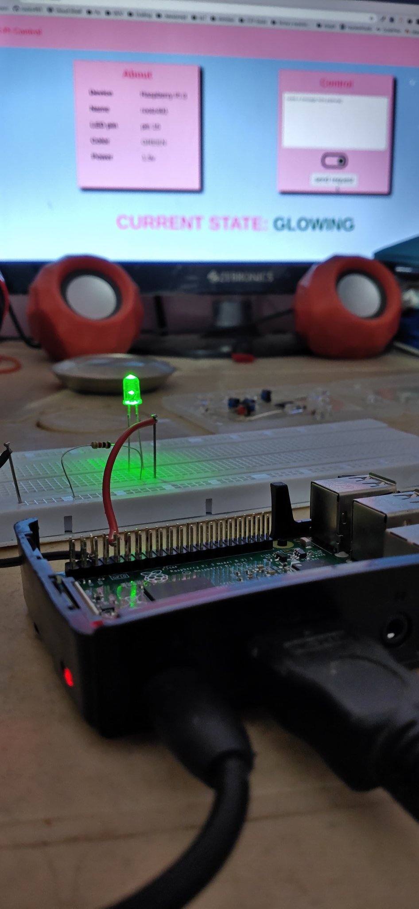

# IoT X Django project

## Tech:

* _Django_ [backend]
* _SQLite3_ [database]
* _html, css_ [templates]
* _Raspberry Pi 3_ [HARDWARE]

## dependencies:

* python 3.7.5
* django 3.1.3
* RPi.gpiozero

## How it works?

>	Django is used for URL mapping, working as perfect server.
>	one of the methods is **update**, used to handle the request (POST)
>	that contain a bool input to change the state of LED.
>	Using GPIOZERO to actually work with built-in PINS of Raspberry Pi
>	anytime user will change the state of LED, it will get stored in database.
>	Also, with changing the state. one can also pass the message. Although it's 
>	just optional but message will get stored along with that change in state and 
>	timeStamp of when state was changed.
>
>	when you'll start working with this source code, for first serve of index page
>	it will show LED is *GLOWING* that's because Last time i tested on it, i left 
>	LED open.
>	
>	gpio15 is the pin number in which you'll have to connect LED in order to work.
>	although you can change the pin number to whatever you want.

## Problems:

*	If you are using python 3.8.x for some reason, then it won't work directly.
*	to make it work, paste *_sqlite.so* in the root of this project directory.
*	Also remember to update Raspberry Pi to it's latest version for complete gpio support.

Thankyou!